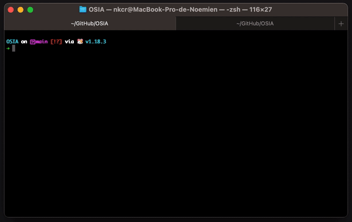

<div align="center">

</div>

# Open Source Instagram Aggregator

[](https://github.com/nkcr/OSIA/actions/workflows/go.yml)
[](https://coveralls.io/github/nkcr/OSIA?branch=main)

OSIA stores your public instagram feed on a DB and offers a simple REST API to
later use your it wherever you want. This is especially convenient to display
your instagram posts on a website.

The application is composed of an aggregator, which periodically checks new
posts and saves them on a local database, and an HTTP server, which serves posts
from the local database. 

<div align="center">



</div>

## Why do I need that ?

Due to past abuses (Cambridge Analytica user data scandal), Facebook restricted
its APIs, including the Instagram one. Even if an Instagram account is public,
fetching its list of posts now requires a valid token that must be renewed at
regular interval. Sadly (for developers, but probably not for Instagram users),
it prevents a website from directly fetching posts from Instagram. Therefore, a
third service is needed to collect posts and serve them.

## Authentication

OSIA uses the [Instagram basic display
API](https://developers.facebook.com/docs/instagram-basic-display-api/). To
fetch posts from a public Instagram account you need to have a valid token. This
token can be generated with the Instagram [token
generator](https://developers.facebook.com/docs/instagram-basic-display-api/overview?locale=en_US#user-token-generator).
Prior to that, you will need to create a Facebook app with the basic instagram
API product. Follow instructions from the official documentation:
https://developers.facebook.com/docs/instagram-basic-display-api/getting-started?locale=en_US#step-1--create-a-facebook-app.

A token has a limited value, but can be renewed. To keep the token valid, OSIA
renews it every time it makes an API call to check the latest posts.

## Requirement

You can use the existing binaries from the [releases
section](https://github.com/nkcr/OSIA/releases), which are completely
self-contained. No additional installation is needed. If you have Go installed
(>=1.18), you can also compile the app yourself. From the root folder:

```sh
# build a binary
go build .
# build a binary and moves it to $GOBIN
go install .
```

## Usage

The Instagram token must be passed as an environment variable, and settings can
be passed via the CLI. To see the options, use `-h`. For example:

```sh
INSTAGRAM_TOKEN=XXX ./OSIA-linux-amd64-a.b.c \
  --interval 30m \
  --dbfilepath data/osia.db \
  --imagesfolder images/ \
  --listen 0.0.0.0:3333
```

The app can be stopped with <kbd>Ctrl</kbd> + <kbd>C</kbd>. To prevent a full
download, it can be re-started with the same database and images folder.

## Read your posts

An HTTP server is bootstrapped at the provided (or default) `listen` address. It
serves the list of medias at the `http://<listen>/api/medias` endpoint. By
default, the endpoint returns a maximum of 12 medias, sorted by timestamp.
Recall that your endpoint is likely to be public, you don't want to expose too
much data.

It is possible to retrieve less than 12 medias by specifying a `count=` URL
parameter:

```
# Returns the last 8 posts
http://0.0.0.0:3333/api/medias?count=8
```

A post has the following attributes:

```
{
  id:
  caption:
  media_type:
  media_url:
  permalink:
  username:
  timestamp:
}
```

## Images

Due to Instagram security restrictions, images hosted by Instagram cannot be
displayed on external websites. Consequentely, a simple ``
tag would not work. To get around that, images are saved locally to the provided
(or default) `imagesfolder` and served at the `http://<listen>/images/<post
id>.jpg` endpoint. "media id" corresponds to the `id` of the post.

## Use docker

You can quickly use OSIA with docker. The following fetches the latest images
from the [github
registry](https://github.com/nkcr/OSIA/pkgs/container/osia-deploy) and runs
OSIA. After that you can open your browser on `localhost:3333/api/medias` and
see your posts. Data are also persisted on a `data/` folder that you can re-use
between runs:

```sh
docker pull ghcr.io/nkcr/osia-deploy:latest
docker run -e INSTAGRAM_TOKEN=XXX -p 3333:3333 -v $(pwd)/data:/data ghcr.io/nkcr/osia-deploy
```

## Deployment

It is recommended to use `systemd` and a reverse proxy, such as `nginx`. Place
`osia.service` in `/etc/systemd/system/`. Replace the `INSTAGRAM_TOKEN` with
yours.

Create the following folders:

```sh
sudo mkkdir /opt/osia/bin
```

Download and move the OSIA binary to `/opt/osia/bin`. Then create an `osia`
user+group, and update the ownership of the osia folder:

```sh
wget https://github.com/nkcr/OSIA/releases/download/va.b.c/osia-linux-amd64-va_b_c /tmp
sudo mv /tmp/osia-linux-amd64-va_b_c /opts/osia/bin/osia

sudo useradd -r osia
sudo chown -R osia:osia /opt/osia
```

Optionally, configure logrotate by copying `osia.logrotate` to
`/etc/logrotate.d/`. You should also configure a reverse proxy, see
`osia.nginx`.

Finally, start the osia service:

```sh
sudo systemctl enable --now osia.service
```

You should then see the starting logs with `sudo service osia status`.

## Practical use

Here is a minimal example using react to render a list of posts using OSIA's
REST API.

```ts
const Instagram = () => {
  const [posts, setPosts] = useState([])

  useEffect(() => {
    fetch(`${ENDPOINT}/api/medias?count=6`)
      .then(response => response.json())
      .then(resultData => {
        setPosts(resultData)
      })
  }, [])

  return (
    <div>
      {posts.map((post) => (
        <Post key={post.id} post={post}/>
      ))}
    </div>
  )
}

const Post = ({ post }) => {
  return (
      <section>
        <a href={post.permalink}>
          
        </a>
        <div>
          <p dangerouslySetInnerHTML={{ __html: post.caption }}></p>
          <p>{post.timestamp}</p>
        </div>
      </section>
  )
}
```

# Dependencies

- [buntdb](https://github.com/tidwall/buntdb) a great key-value store for storing the posts (MIT license)
- [go-flags](https://github.com/jessevdk/go-flags) for argument parsing (BSD-3-Clause license)
- [zerolog](https://github.com/rs/zerolog) for logging (MIT license)
- [testify](https://github.com/stretchr/testify) for unit testing (MIT license)