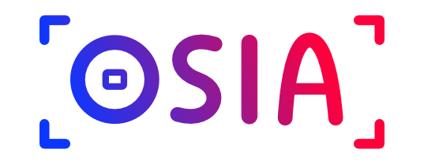

<div align="center">

</div>

# Open Source Instagram Aggregator

[](https://github.com/nkcr/OSIA/actions/workflows/go.yml)
[](https://coveralls.io/github/nkcr/OSIA?branch=main)

OSIA stores your public instagram feed on a DB and offers a simple REST API to
later use your it wherever you want. This is especially convenient to display
your instagram posts on a website.

The application is composed of an aggregator, which periodically fetches the
Instagram post, and an HTTP server that responds to HTTP queries. The Instagram
token must be passed as an environment variable, and the aggregator fetch
interval as a CLI argument with `--interval`. For example:

```sh
INSTAGRAM_TOKEN=XXX go run . --interval=30m
```